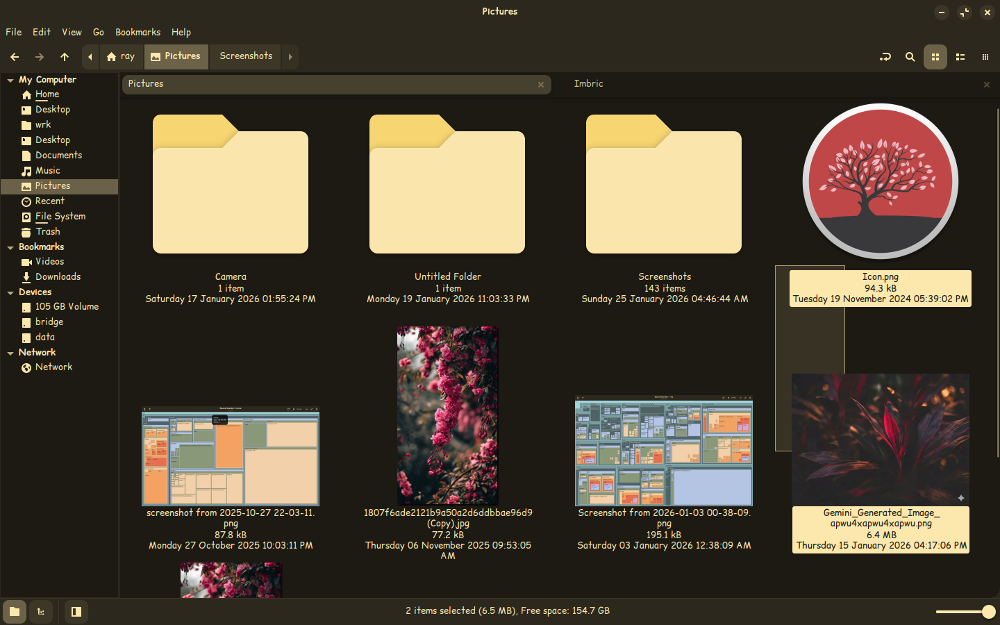
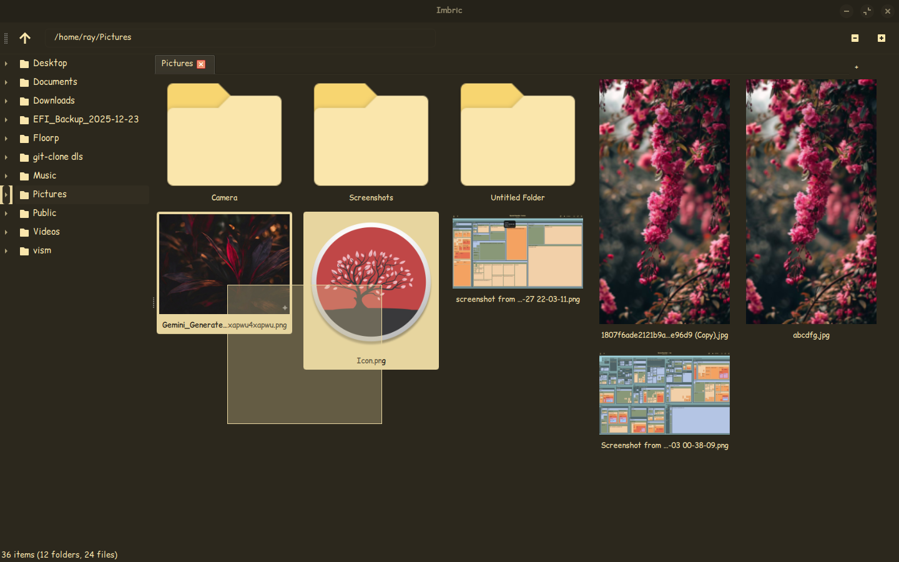

```
        █ █▀▄▀█ █▄▄ █▀█ █ █▀▀
        █ █░▀░█ █▄█ █▀▄ █ █▄▄ 
 Your Photos. Your Filesystem. Zero Lag.
```

> **Imbric** doesn't manage your files.
> It *lenses* them.

## The Philosophy

Most file managers treat photos like spreadsheet rows.  
Imbric treats them like **what they are**: visual objects with shape, color, and time.

```
```
┌───────────────────────────────────────────────────────────────┐
│                             vs.                               │
│   Traditional Grid                    Justified Grid          │
│                                                               │
│   [ Grid of boxes ]                   [  Google Photos   ]    │
│   [  with wasted  ]                   [      Style       ]    │
│   [     space     ]                   [  Dynamic  Rows   ]    │
│                                                               │
│   Wasted space. ❌                                            │
│                                                               │
│   Every pixel used. ✓                                         │
│                                                               │
└───────────────────────────────────────────────────────────────┘
```

<table>
  <tr>
    <td align="center"><strong>Traditional Grid (Nemo)</strong></td>
    <td align="center"><strong>Imbric Justified Grid</strong></td>
  </tr>
  <tr>
    <td></td>
    <td></td>
  </tr>
</table>

## How It Works

Imbric is a **lens**, not an engine. It doesn't reinvent Linux. It *uses* it.

| What           | How Imbric Does It              | Why It's Fast                        |
| -------------- | ------------------------------- | ------------------------------------ |
| **Thumbnails** | `GnomeDesktop.ThumbnailFactory` | Same cache as Nautilus. Pre-baked.   |
| **File Ops**   | `Gio` (GLib I/O)                | Kernel-level. Zero Python overhead.  |
| **Layout**     | Justified Grid                  | Respects aspect ratios. Zero crop.   |
| **Sorting**    | `QSortFilterProxyModel`         | C++ side. Instant.                   |

```
                    ┌──────────────────┐
                    │   YOUR PHOTOS    │
                    └────────┬─────────┘
                             │
                             ▼
              ┌──────────────────────────────┐
              │  LinuxDesktop + Gio (C libs) │  ◀── The heavy lifting
              └──────────────┬───────────────┘
                             │
                             ▼
              ┌──────────────────────────────┐
              │  Python (Thin Orchestrator)  │  ◀── Just glue code
              └──────────────┬───────────────┘
                             │
                             ▼
              ┌──────────────────────────────┐
              │  Qt Quick / QML (60fps UI)   │  ◀── What you see
              └──────────────────────────────┘
```

<br/>

---

<br/>

## Get It Running

```bash
# Prerequisites (Debian/Ubuntu/Zorin)
sudo apt install python3-gi gir1.2-gnomedesktop-3.0

# Clone & Run
git clone https://github.com/yourusername/imbric.git
cd imbric
pip install -r requirements.txt
python3 main.py ~/Pictures
```

<br/>

---

<br/>

## Roadmap

```
Phase 1 ███████████████████████████████████████  [DONE]  Native Shell
Phase 2 ███████████████████████████████████████  [DONE]  Justified Grid Engine
Phase 3 ███████████████████████████████████████  [DONE]  Thumbnails (GNOME)
Phase 4 ███████████████████████████████████████  [DONE]  Async I/O & Tabs
Phase 5 ████████████████████░░░░░░░░░░░░░░░░░░░  [BUSY]  Interactions
```

<br/>

---

<br/>

## License

MIT. Use it. Fork it. Ship it.  
See [LICENSE](LICENSE).

<br/>

---

<br/>

```
Built for Linux. Built with GNOME and QT. Built to be fast.
```
